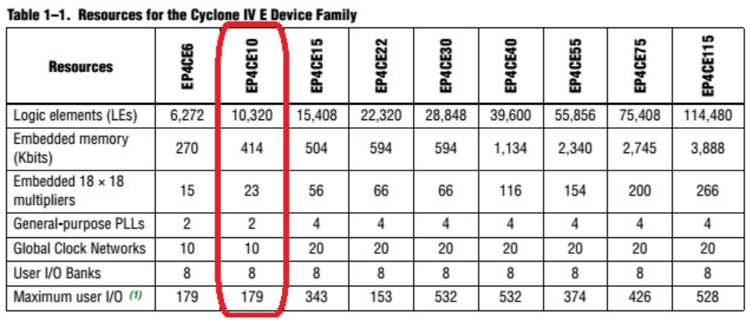
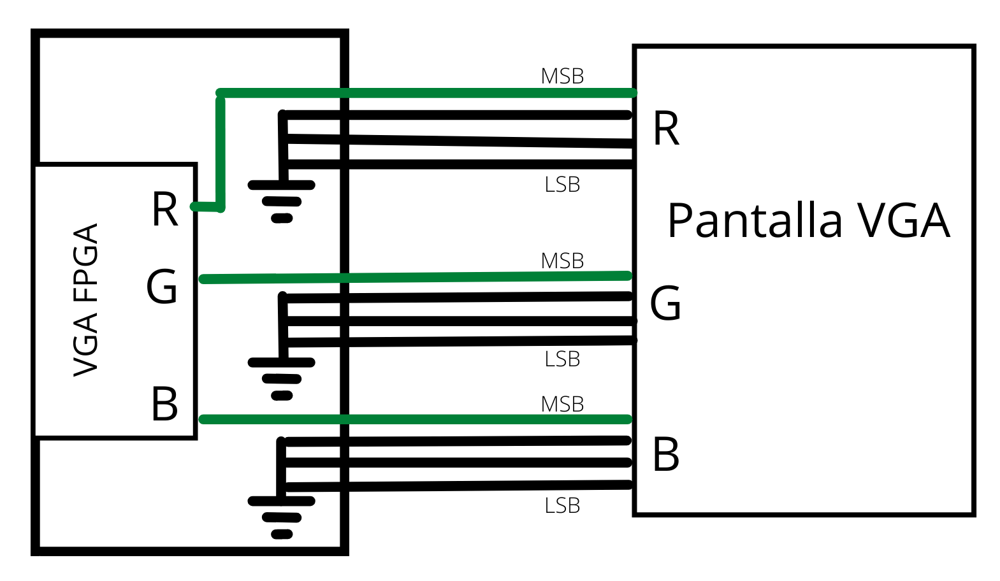

# Proyecto final Electronica digital I - "El juego de la memoria"

## Grupo 5

- Nicolás Velásquez Ospina
- Jhair Steven Gallego Mendez
- Juan David Sarmiento Lastra

## Introducción

Durante el curso se han visto diversos temas que implican el aprendizaje y entendimiento del lenguaje en verilog, la manipulación de quartus, realización de chequeos con el testbech y la implementación de la lógica en la FPGA, asignando entonces pines para poder llevar el funcionamiento del circuito al hardware, y ultimadamente usando dispositivos para el muestreo como lo es un monitor VGA. Es así como en este proyecto, se aplican nuevamente esos conocimientos adquiridos para fines lúdicos y educativos, llegando entonces al desarrollo de un juego algo simple pero que muestra en entendimiento de los tópicos vistos dentro del curso. Es denominado el juego de la memoria y se verá cómo funciona desde el desarrollo del código hasta la implementación en la tarjeta y la pantalla VGA, de modo que el usuario pueda interactuar por medio de la tarjeta, logrando “jugar”


## Desarrollo

En esta sección se verá cómo se planeó el desarrollo del juego.

## Preguntas planteadas.

### Pregunta 1.
### Definir, ¿Cuál es el tamaño máximo de buffer de memoria que puede crear, acorde a la FPGA?, contraste este resultado con la memoria necesaria para la visualización en un pantalla VGA 640 x 480 de RGB444, y compruebe si es posible dejando el 50 % libre de la memoria.

Revisando el datasheet de la tarjeta usada, en este caso el modelo Cyclone IV FPGA EP4CE10E22C8N, nos encontramos que este proporciona una tabla donde se mencionan las distintas capacidades de memoria RAM de la tarjeta (en Kbits), para varios tipos de modelos similar al de la tarjeta usada. 



Por la información de la tabla nos podemos dar cuenta que para la FPGA EP4CE10E22C8N, la capacidad de memoria es de 414 Kbits. Ahora es necesario contrastar esto con lo que se necesitaría de capacidad de memoria para la visualización en una pantalla VGA 640 x 480 de RGB 444, por lo que según esto 640 x 480= 307200 pixeles y esto multiplicado por los bits necesarios en el RGB 444(4+4+4=12), por lo tanto, 307200x12 = 3'648.400/1024 = 3600 Kbytes. Comparando este último resultado con la capacidad de memoria con la que cuenta la tarjeta nos damos cuenta que queda evidentemente corta, y con esto no sería posible dejar el 50% del espacio de la memoria libre.

### Pregunta 2.
### Revise el datasheet de la tarjeta de desarrollo que usted está usando y compruebe el pinout necesario para la implementación ¿Debe realizar algún cambio en el apartado anterior y que criterios debe tener en cuenta para ello?

Según lo encontrado en el datasheet de la tarjeta de desarrollado, sumado a lo explicado por el profesor en clase, nos damos cuenta que la tarjeta solo cuenta con un pin de salida para cada uno de los RGB respectivos, es decir, que no es posible que sea RGB 444, como se había planteado inicialmente. Es por esto que se deben conectar tres pines a tierra tanto para R, como para G y B, de tal manera que el bit más significativo sea el que esté conectado al conector de salida VGA de la tarjeta y la pantalla. Esto último se puede apreciar mejor en el siguiente esquema.



### Pregunta 3.
### ¿Usted qué estrategia para modificar la RAM considera para la implementación de la FSM del juego?

Debido a que la lógica del juego no necesita de mucho espacio para guardar sus datos y operar de manera óptima, no es necesario utilizar un módulo de memoria RAM dedicado. De este modo, la modificación para modificar la RAM consistiria en no hacer uso de ella, puesto que sería un consumo de recursos innecesario.


## Descripción del juego

El juego de la memoria, también conocido como el juego de voltear tarjetas, es aquel donde se tienen una serie de tarjetas, las cuales todas tienen una cara en común y del otro lado de la cara tendrán un dibujo característico. Es así, como se contará con parejas de tarjetas que tengan exactamente la misma figura de una cara y la misma de la otra cara. Se procede a colocar todas las cartas boca abajo en un espacio, donde claramente no se sabe la ubicación de cada tarjeta, haciendo que quede un mosaico de tarjetas con patrones iguales entre sí, pero que tienen dibujos característicos debajo de ellas.

La forma de jugar es que el sujeto de pruebas voltea dos tarjetas por turno, teniendo así la posibilidad de hallar la ubicación de dos de las figuras, y posteriormente procede a voltearlas en la posición original para ceder el turno a otro jugador, o para seguir jugado él mismo, ya que es un juego de varios o un solo jugador. Es así como, poco a poco se va sabiendo la ubicación de las tarjetas a medida que los usuarios van volteando y revelando ubicaciones. El objetivo será entonces forma una pareja, lo cual ocurre sacando dos tarjetas con la misma figura en un mismo turno, cosa que otorga un turno extra al jugador.

Este fue el juego escogido por el grupo, el cual como se puede ver es algo simple, pero cumple su función y es posible de implementar en la pantalla VGA. Cabe destacar que se procuró usar todo el display, razón por la cual se dividió en una resolución de 4x2, cosa que fue ideal para el juego ya que cada píxel de resolución podía simbolizar una carta a usar, y el cambio de color sería voltear la carta; además, se cuenta con ocho dip - switchs en la tarjeta, por lo que también se puede aprovechar esto.

## Simplifiación del juego

Dado a que el tiempo era limitado, se tuvieron que realizar ciertas simplificaciones en el juego, de modo que fuese posible de implementar en la tarjeta exitosamente. Estas simplificaciones si bien son notables y se pueden ver en el funcionamiento, no afectan la idea inicial del juego ni las reglas de este, únicamente fueron hechas debido a las limitaciones de recursos y de tiempo. Fueron las siguientes.

-  El número de cartas usadas fue de ocho, debido a la división del display en 4x2. Es así como se posee un número de cuatro posibles parejas para encontrar. Si bien, el juego es algo corto, solamente es para fines educativos.
- Las cartas no muestran figuras al voltearse, sino que se toman colores, dado a que la idea es la misma y es lo más simplificado que se puede llegar a hacer. Surgió la idea de colocar algunas figuras para darle más personalidad al juego, pero se terminó por descartar debido a los ajustes que se tenían que realizar en el display, haciendo que quizá no alcance la memoria.
- La ubicación de los colores de las cartas no cambia, es la misma siempre. Realmente no se programó una distribución aleatoria para los colores mostrados “al voltear la carta”, por lo que siempre estarán la misma ubicación y lo único que cambia es el orden en el que se voltean las cartas. El botón de reset colocará las cartas en su color original, es decir, todas de exactamente el mismo color.


## Diseño e idea inicial del proyecto


```verilog 
module VGA_Driver640x480 #(
	parameter SCREEN_X = 640,
	parameter SCREEN_Y = 480
)
(
	input rst,  // Entrada reset
	input clk, 	// Entrada reloj 25MHz para 60 hz de 640x480
	input  [11:0] pixelIn, 	// entrada del valor de color  pixel 
	output  [11:0] pixelOut, // salida pixel VGA (RGB)
	output  Hsync_n,		// señal de sincronización en horizontal negada
	output  Vsync_n,		// señal de sincronización en vertical negada 
	output  [9:0] posX, 	// posición en horizontal del pixel siguiente
	output  [8:0] posY 		//posición en vertical  del pixel siguiente
);

// localparam SCREEN_X = 640; // Tamaño de la VGA horizontal 
localparam FRONT_PORCH_X =16;  // Pixeles de sincronización
localparam SYNC_PULSE_X = 96;
localparam BACK_PORCH_X = 48;
localparam TOTAL_SCREEN_X = SCREEN_X+FRONT_PORCH_X+SYNC_PULSE_X+BACK_PORCH_X; 	// total píxel pantalla en horizontal 


// localparam SCREEN_Y = 480;  // Tamaño de la VGA vertical
localparam FRONT_PORCH_Y =10;  // Pixeles de sincronización
localparam SYNC_PULSE_Y = 2;
localparam BACK_PORCH_Y = 33;
localparam TOTAL_SCREEN_Y = SCREEN_Y+FRONT_PORCH_Y+SYNC_PULSE_Y+BACK_PORCH_Y; 	// total píxel pantalla en vertical 


reg  [9:0] countX;
reg  [8:0] countY;

assign posX    = countX;
assign posY    = countY;

assign pixelOut = (countX<SCREEN_X) ? (pixelIn ) : (12'b000000000000) ; // dejar en blanco la zona del porch

assign Hsync_n = ~((countX>=SCREEN_X+FRONT_PORCH_X) && (countX<SCREEN_X+SYNC_PULSE_X+FRONT_PORCH_X)); // sincronización horizontal
assign Vsync_n = ~((countY>=SCREEN_Y+FRONT_PORCH_Y) && (countY<SCREEN_Y+FRONT_PORCH_Y+SYNC_PULSE_Y)); // sincronización vertical


always @(posedge clk) begin
	if (~rst) begin
		countX <= TOTAL_SCREEN_X-10; //*para la simulación sea mas rápida
		countY <= TOTAL_SCREEN_Y-4; //para la simulación sea mas rápida
	end
	else begin 
		if (countX >= (TOTAL_SCREEN_X)) begin
			countX <= 0;
			if (countY >= (TOTAL_SCREEN_Y)) begin
				countY <= 0;
			end 
			else begin
				countY <= countY + 1;
			end
		end 
		else begin
			countX <= countX + 1;
			countY <= countY;
		end
	end
end

endmodule
```


## Conclusiónes

- La reducción y simplificación a la hora de mostrar en el monitor VGA es imprescindible de tomar en cuenta dado a la memoria limitada de la tarjeta, la cual se puede saturar y no sería posible almacenar la imagen completa del monitor suponiendo que se usa RGB y toda la gama de colores posibles. Es por esto que se limitó únicamente a ocho colores y a “píxeles” rectangulares de 160x240, condición suficiente para hacer funcionar al juego propuesto. 
- Es necesario un divisor de frecuencia para sincronizar la frecuencia con la que trabaja la tarjeta y con la que el VGA va a mostrar la información. Esto en la simulación no es necesario, pero es fundamental a la hora de implementar en el hardware para asegurar su buen funcionamiento.
- Con una buena idea de diseño, es relativamente simple desarrollar un juego funcional aprovechando los recursos disponibles y superando las limitaciones que significa trabajar con una tarjeta y un monitor VGA. Sin duda alguna el proyecto hubiese sido mejor y más detallado con algunas mejoras si se hubiese dispuesto de un tiempo considerable.
- Es posible implementar en la tarjeta y mostrar figuras conformadas por funciones matemáticas en el monitor VGA, haciendo que se tenga por lo menos una forma de diseñar un escenario en futuros juegos. Sin embargo, sólo fue un pequeño experimento para profundizar en cómo funciona este tipo de tecnología.

