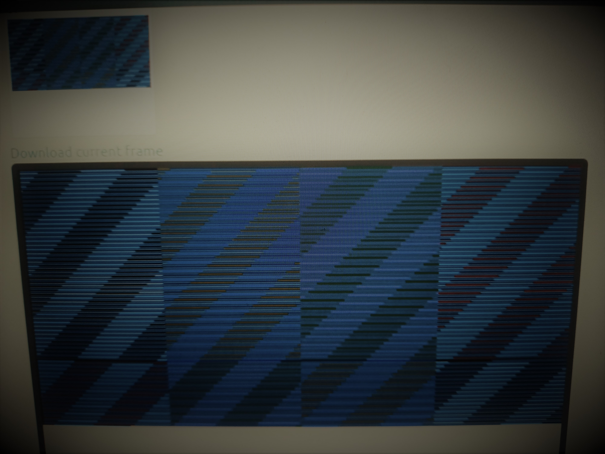

# Proyecto final Electronica digital I - "El juego de la memoria"

## Grupo 5.

- Nicolás Velásquez Ospina.
- Jhair Steven Gallego Mendez.
- Juan David Sarmiento Lastra.

## Introducción

Durante el curso se han visto diversos temas que implican el aprendizaje y entendimiento del lenguaje en verilog, la manipulación de quartus, realización de chequeos con el testbech y la implementación de la lógica en la FPGA, asignando entonces pines para poder llevar el funcionamiento del circuito al hardware, y ultimadamente usando dispositivos para el muestreo como lo es un monitor VGA. Es así como en este proyecto, se aplican nuevamente esos conocimientos adquiridos para fines lúdicos y educativos, llegando entonces al desarrollo de un juego algo simple pero que muestra en entendimiento de los tópicos vistos dentro del curso. Es denominado el juego de la memoria y se verá cómo funciona desde el desarrollo del código hasta la implementación en la tarjeta y la pantalla VGA, de modo que el usuario pueda interactuar por medio de la tarjeta, logrando “jugar”

## Objetivos

- Modificar el código suministrado para realizar simulaciones de visualización de imágenes en resolución VGA por medio de archivos de salida que puede ser testeados en páginas web con esta función, dando la posibilidad de observar la imagen.
- Hacer la implementación del código modificando los módulos para poder acoplar satisfactoriamente una pantalla VGA real con una resolución compatible con la tarjeta Cyclone IV suministrada para poder mostrar una imagen programa en la pantalla.
- Por medio de lógica y demás recursos adquiridos en el aprendizaje de la clase, diseñar un programa capaz de emular un juego al gusto del grupo. Se escogió al juego de la memoria debido a la simplicidad del mismo y el tiempo limitado.
- Obtener un juego funcional que use como interfaz de visualización al monitor VGA y de manipulación a la tarjeta, por medio de los dipswitch o cualquier otra adición que sea necesaria de realizar para poder colocar los controles.


## Implementos
- Pantalla con entrada VGA y cuya resolución sea 640x480.
- FPGA que cuenta con puerto VGA. (Cyclone IV)
- Cable VGA.
- Código.


## Preguntas planteadas

### Pregunta 1.
### Definir, ¿Cuál es el tamaño máximo de buffer de memoria que puede crear, acorde a la FPGA?, contraste este resultado con la memoria necesaria para la visualización en un pantalla VGA 640 x 480 de RGB444, y compruebe si es posible dejando el 50 % libre de la memoria.

Revisando el datasheet de la tarjeta usada, en este caso el modelo Cyclone IV FPGA EP4CE10E22C8N, nos encontramos que este proporciona una tabla donde se mencionan las distintas capacidades de memoria RAM de la tarjeta (en Kbits), para varios tipos de modelos similar al de la tarjeta usada. 


Por la información de la tabla nos podemos dar cuenta que para la FPGA EP4CE10E22C8N, la capacidad de memoria es de 414 Kbits. Ahora es necesario contrastar esto con lo que se necesitaría de capacidad de memoria para la visualización en una pantalla VGA 640 x 480 de RGB 444, por lo que según esto 640 x 480= 307200 pixeles y esto multiplicado por los bits necesarios en el RGB 444(4+4+4=12), por lo tanto, 307200x12 = 3'648.400/1024 = 3600 Kbytes. Comparando este último resultado con la capacidad de memoria con la que cuenta la tarjeta nos damos cuenta que queda evidentemente corta, y con esto no sería posible dejar el 50% del espacio de la memoria libre.

### Pregunta 2.
### Revise el datasheet de la tarjeta de desarrollo que usted está usando y compruebe el pinout necesario para la implementación ¿Debe realizar algún cambio en el apartado anterior y que criterios debe tener en cuenta para ello?

Según lo encontrado en el datasheet de la tarjeta de desarrollado, sumado a lo explicado por el profesor en clase, nos damos cuenta que la tarjeta solo cuenta con un pin de salida para cada uno de los RGB respectivos, es decir, que no es posible que sea RGB 444, como se había planteado inicialmente. Es por esto que se deben conectar tres pines a tierra tanto para R, como para G y B, de tal manera que el bit más significativo sea el que esté conectado al conector de salida VGA de la tarjeta y la pantalla. Esto último se puede apreciar mejor en el siguiente esquema.


### Pregunta 3.
### ¿Usted qué estrategia para modificar la RAM considera para la implementación de la FSM del juego?

Debido a que la lógica del juego no necesita de mucho espacio para guardar sus datos y operar de manera óptima, no es necesario utilizar un módulo de memoria RAM dedicado. De este modo, la modificación para modificar la RAM consistiria en no hacer uso de ella, puesto que sería un consumo de recursos innecesario.


## Descripción del juego

El juego de la memoria, también conocido como el juego de voltear tarjetas, es aquel donde se tienen una serie de tarjetas, las cuales todas tienen una cara en común y del otro lado de la cara tendrán un dibujo característico. Es así, como se contará con parejas de tarjetas que tengan exactamente la misma figura de una cara y la misma de la otra cara. Se procede a colocar todas las cartas boca abajo en un espacio, donde claramente no se sabe la ubicación de cada tarjeta, haciendo que quede un mosaico de tarjetas con patrones iguales entre sí, pero que tienen dibujos característicos debajo de ellas.

La forma de jugar es que el sujeto de pruebas voltea dos tarjetas por turno, teniendo así la posibilidad de hallar la ubicación de dos de las figuras, y posteriormente procede a voltearlas en la posición original para ceder el turno a otro jugador, o para seguir jugado él mismo, ya que es un juego de varios o un solo jugador. Es así como, poco a poco se va sabiendo la ubicación de las tarjetas a medida que los usuarios van volteando y revelando ubicaciones. El objetivo será entonces forma una pareja, lo cual ocurre sacando dos tarjetas con la misma figura en un mismo turno, cosa que otorga un turno extra al jugador.

Este fue el juego escogido por el grupo, el cual como se puede ver es algo simple, pero cumple su función y es posible de implementar en la pantalla VGA. Cabe destacar que se procuró usar todo el display, razón por la cual se dividió en una resolución de 4x2, cosa que fue ideal para el juego ya que cada píxel de resolución podía simbolizar una carta a usar, y el cambio de color sería voltear la carta; además, se cuenta con ocho dip - switchs en la tarjeta, por lo que también se puede aprovechar esto.

## Simplificación del juego

Dado a que el tiempo era limitado, se tuvieron que realizar ciertas simplificaciones en el juego, de modo que fuese posible de implementar en la tarjeta exitosamente. Estas simplificaciones si bien son notables y se pueden ver en el funcionamiento, no afectan la idea inicial del juego ni las reglas de este, únicamente fueron hechas debido a las limitaciones de recursos y de tiempo. Fueron las siguientes.

-  El número de cartas usadas fue de ocho, debido a la división del display en 4x2. Es así como se posee un número de cuatro posibles parejas para encontrar. Si bien, el juego es algo corto, solamente es para fines educativos.
- Las cartas no muestran figuras al voltearse, sino que se toman colores, dado a que la idea es la misma y es lo más simplificado que se puede llegar a hacer. Surgió la idea de colocar algunas figuras para darle más personalidad al juego, pero se terminó por descartar debido a los ajustes que se tenían que realizar en el display, haciendo que quizá no alcance la memoria.
- La ubicación de los colores de las cartas no cambia, es la misma siempre. Realmente no se programó una distribución aleatoria para los colores mostrados “al voltear la carta”, por lo que siempre estarán la misma ubicación y lo único que cambia es el orden en el que se voltean las cartas. El botón de reset colocará las cartas en su color original, es decir, todas de exactamente el mismo color.


## Diseño e idea inicial del proyecto

Al principio del planteamiento del juego, realmente no se pensó desde siempre en hacer el juego de la memoria, sino que se tenía la idea de algo un poco más sencillo. La idea era tomar y dividir la pantalla mostrada en el VGA en ocho partes iguales, de manera que se pudieran visualizar perfectamente a los ocho colores en el display. El cambio radicaba en que el usuario podría cambiar estos colores al negado binario que representaba esto en el código al oprimir el dipswitch asociado a cada “píxel”. La resolución de la pantalla era de 640x480, por lo que se dividió horizontalmente en cuatro partes y verticalmente en dos, quedando entonces con ocho rectángulos iguales de 160x240 en resolución 2x4, cada uno asociado a un registro que guardaba el color.

De esta forma, sería posible usar toda la pantalla de colores sin llenar la memoria de la tarjeta, en lugar de sólo emular el juego en un pequeño espacio del monitor debido a la reducción en la resolución. Es así como mediante la configuración correcta para acoplar los módulos correspondientes al VGA se pudo realizar la lógica del programa, la cual podía emular todos los colores disponibles. Usando el archivo de salida imagen.men y colocando un reloj para cambiar constantemente la señal de los dipswitch a ver si la lógica funcionaba en el simulador web de imagen VGA, se pudo observar que la imagen arrojada por la página confirmaba el funcionamiento.


	* Archivo image.men subido a la página de simulación con un reloj que cambiaba la señal del registro de los colores comprobando que se cambiaban a su negado.

Al comprobar que todo estaba en orden con la lógica diseñaba y el funcionamiento era un hecho, logrando no obtener errores o alertas significativas, se emprendió la labor de acoplar el monitor. Es así como por medio de un monitor VGA de uno de los integrantes del grupo, el proyecto pudo ser implementado en la tarjeta y mostrado en su estado inicial en la pantalla, en la pantalla, justamente en la resolución que se planeó. Los colores se configuraron un poco más vívidos que los que aparecían en la simulación de la pantalla en la página, de modo que eran más fáciles de distinguir. El problema es que habían unos inexplicables errores a la hora del muestreo, donde aparecían líneas blancas en la pantalla inicial, pero que sin embargo, era algo despreciable que no afectaba al funcionamiento del juego e incluso era a veces imperceptible.


	* Idea inicial de proyecto implementada y mostrada en el monitor VGA exitosamente.

Ya teniendo básicamente todo listo para presentar, surgió la idea de ser más creativos más allá de sólo hacer que los colores cambien a su negado, y es así como se pensó en la aplicación del juego de la memoria, sacando parejas que serían colores debido a la simplicidad del programa. Cambiar el código para emular este juego no era una tarea tan complicada, puesto a que ahora sólo había que colocar todas las tarjetas en su estado inicial en un color determinado, y cuando se activase el dipswitch asociado a cada una simplemente se cambiará a un color colocando en el código, fijando así las posiciones de las parejas. No obstante, la única forma de cambiar esta posición es mediante editar el código cambiando los colores y las posiciones, básicamente, de modo que cada píxel será una tarje que tendrá dos estados, el defecto y cuando se activa el dipswitch. 


	* Juego final implementado en el monitor VGA y FPGA.

Una vez implementado el juego se buscó tratar de mejorar agregando algunas figuras simples como círculos o cuadrados a las tarjetas ya volteadas. Es así como se intentó y logró con éxito mostrar una figura diferente a un rectángulo, en este caso, un círculo con el código, el cual estaría listo para ser mostrado en el monitor en el caso de ser necesario. Sin embargo, se planteó que esto sería mucho más difícil de lo pensado y se tendrían que hacer significativos cambios al código para poder lograr mostrar las figuras, dado a que ya las cartas no serían simples píxeles, se tenía que usar más memoria y rediseñar el código que ya estaba listo. Sin embargo, se quedó con el aprendizaje de cómo emular figuras a partir de sus expresiones lógicas.


	* Experimento de muestreo de un círculo en VGA usando el sitio de simulación propuesto.

Finalmente, se documentó todo el código usado y todo fue subido al informe final para la presentación en clase.

## Código de los módulos usados
A continuación, se verán los códigos de los módulos programados para que el juefo funcione correctamente tanto en la simulación como en la implementación. Se comentaron las partes más importantes y aclaraciones de porqué se usan o no se usan algunos parámetros, cono la memoria RAM, por ejemplo.

### FSM_game.v
Lógica para el funcionamiento del juego.

```verilog 
`timescale 1ns / 1ps

module FSM_game # (
		parameter AW = 3,
		parameter DW = 3)
	(
	 	input clk, input rst,
		input sw0, input sw1, input sw2, input sw3,
		input sw4, 	input sw5, 	input sw6, 	input sw7,
		output reg [DW-1:0] cuadroColores0,
		output reg [DW-1:0] cuadroColores1,
		output reg [DW-1:0] cuadroColores2,
		output reg [DW-1:0] cuadroColores3,
		output reg [DW-1:0] cuadroColores4,
		output reg [DW-1:0] cuadroColores5,
		output reg [DW-1:0] cuadroColores6,
		output reg [DW-1:0] cuadroColores7
   );

	/* Lógica para simular un cambio de color cuando se oprime un interruptor dentro del rango [0, 7]. El cambio de color viene dado como el negado del color actual almacenado en la posición de memoria respectiva. Por ejemplo, si se oprime el interruptor 2 y a ese le corresponde el color 001 (sin oprimir el interruptor), el resultado será 110.*/
	localparam colorBase = 3'b010;
	always @(posedge clk) begin
			if (sw0)
				cuadroColores0 = colorBase;
			else 
				cuadroColores0 = 3'b111;
			if (sw1)
				cuadroColores1 = colorBase;
			else
				cuadroColores1 = 3'b001;
			if (sw2)
				cuadroColores2 = colorBase;
			else
				cuadroColores2 = 3'b001;
			if (sw3)
				cuadroColores3 = colorBase;
			else
				cuadroColores3 = 3'b110;
			if (sw4)
				cuadroColores4 = colorBase;
			else
				cuadroColores4 = 3'b011;
			if (sw5)
				cuadroColores5 = colorBase;
			else
				cuadroColores5 = 3'b110;
			if (sw6)
				cuadroColores6 = colorBase;
			else
				cuadroColores6 = 3'b011;
			if (sw7)
				cuadroColores7 = colorBase;
			else
				cuadroColores7 = 3'b111;
	end

endmodule
```

### VGA_driver.v
Código para acoplar la pantalla VGA.

```verilog 
module VGA_Driver640x480 #(
	parameter SCREEN_X = 640,
	parameter SCREEN_Y = 480
)
(
	input rst,  // Entrada reset
	input clk, 	// Entrada reloj 25MHz para 60 hz de 640x480
	input  [11:0] pixelIn, 	// entrada del valor de color  pixel 
	output  [11:0] pixelOut, // salida pixel VGA (RGB)
	output  Hsync_n,		// señal de sincronización en horizontal negada
	output  Vsync_n,		// señal de sincronización en vertical negada 
	output  [9:0] posX, 	// posicion en horizontal del pixel siguiente
	output  [8:0] posY 		// posicion en vertical  del pixel siguiente
);

// localparam SCREEN_X = 640; // Tamaño de la VGA horizontal 
localparam FRONT_PORCH_X =16;  // Pixeles de sincronización
localparam SYNC_PULSE_X = 96;
localparam BACK_PORCH_X = 48;
localparam TOTAL_SCREEN_X = SCREEN_X+FRONT_PORCH_X+SYNC_PULSE_X+BACK_PORCH_X; 	// total pixel pantalla en horizontal 


// localparam SCREEN_Y = 480;  // Tamaño de la VGA vertical
localparam FRONT_PORCH_Y =10;  // Pixeles de sincronización
localparam SYNC_PULSE_Y = 2;
localparam BACK_PORCH_Y = 33;
localparam TOTAL_SCREEN_Y = SCREEN_Y+FRONT_PORCH_Y+SYNC_PULSE_Y+BACK_PORCH_Y; 	// total pixel pantalla en Vertical 


reg  [9:0] countX;
reg  [8:0] countY;

assign posX    = countX;
assign posY    = countY;

assign pixelOut = (countX<SCREEN_X) ? (pixelIn ) : (12'b000000000000) ; // Dejar en blanco la zona del porch

assign Hsync_n = ~((countX>=SCREEN_X+FRONT_PORCH_X) && (countX<SCREEN_X+SYNC_PULSE_X+FRONT_PORCH_X)); // Sincronización horizontal
assign Vsync_n = ~((countY>=SCREEN_Y+FRONT_PORCH_Y) && (countY<SCREEN_Y+FRONT_PORCH_Y+SYNC_PULSE_Y)); // Sincronización vertical


always @(posedge clk) begin
	if (~rst) begin
		countX <= TOTAL_SCREEN_X-10; /*para la simulación sea mas rapido*/
		countY <= TOTAL_SCREEN_Y-4;/*para la simulación sea mas rapido*/
	end
	else begin 
		if (countX >= (TOTAL_SCREEN_X)) begin
			countX <= 0;
			if (countY >= (TOTAL_SCREEN_Y)) begin
				countY <= 0;
			end 
			else begin
				countY <= countY + 1;
			end
		end 
		else begin
			countX <= countX + 1;
			countY <= countY;
		end
	end
end

endmodule
```

### buffer_ram_dp.v
Simulación VGA.

```verilog 
module VGA_Driver640x480 #(
	parameter SCREEN_X = 640,
	parameter SCREEN_Y = 480
)
(
	input rst,  // Entrada reset
	input clk, 	// Entrada reloj 25MHz para 60 hz de 640x480
	input  [11:0] pixelIn, 	// entrada del valor de color  pixel 
	output  [11:0] pixelOut, // salida pixel VGA (RGB)
	output  Hsync_n,		// señal de sincronización en horizontal negada
	output  Vsync_n,		// señal de sincronización en vertical negada 
	output  [9:0] posX, 	// posición en horizontal del pixel siguiente
	output  [8:0] posY 		//posición en vertical  del pixel siguiente
);

// localparam SCREEN_X = 640; // Tamaño de la VGA horizontal 
localparam FRONT_PORCH_X =16;  // Pixeles de sincronización
localparam SYNC_PULSE_X = 96;
localparam BACK_PORCH_X = 48;
localparam TOTAL_SCREEN_X = SCREEN_X+FRONT_PORCH_X+SYNC_PULSE_X+BACK_PORCH_X; 	// total píxel pantalla en horizontal 


// localparam SCREEN_Y = 480;  // Tamaño de la VGA vertical
localparam FRONT_PORCH_Y =10;  // Pixeles de sincronización
localparam SYNC_PULSE_Y = 2;
localparam BACK_PORCH_Y = 33;
localparam TOTAL_SCREEN_Y = SCREEN_Y+FRONT_PORCH_Y+SYNC_PULSE_Y+BACK_PORCH_Y; 	// total píxel pantalla en vertical 


reg  [9:0] countX;
reg  [8:0] countY;

assign posX    = countX;
assign posY    = countY;

assign pixelOut = (countX<SCREEN_X) ? (pixelIn ) : (12'b000000000000) ; // dejar en blanco la zona del porch

assign Hsync_n = ~((countX>=SCREEN_X+FRONT_PORCH_X) && (countX<SCREEN_X+SYNC_PULSE_X+FRONT_PORCH_X)); // sincronización horizontal
assign Vsync_n = ~((countY>=SCREEN_Y+FRONT_PORCH_Y) && (countY<SCREEN_Y+FRONT_PORCH_Y+SYNC_PULSE_Y)); // sincronización vertical


always @(posedge clk) begin
	if (~rst) begin
		countX <= TOTAL_SCREEN_X-10; //*para la simulación sea mas rápida
		countY <= TOTAL_SCREEN_Y-4; //para la simulación sea mas rápida
	end
	else begin 
		if (countX >= (TOTAL_SCREEN_X)) begin
			countX <= 0;
			if (countY >= (TOTAL_SCREEN_Y)) begin
				countY <= 0;
			end 
			else begin
				countY <= countY + 1;
			end
		end 
		else begin
			countX <= countX + 1;
			countY <= countY;
		end
	end
end

endmodule
```

### half_clk.v
```verilog 
`timescale 1ns / 1ps

module half_clk (input clk, output clk_half);

reg cfreq = 0;

assign clk_half = cfreq;

always @(posedge clk) begin
    if (cfreq > 2'b11) 
        // para que su valor no se incremente indefinidamente
        cfreq <= 0; 
    else
        cfreq <= cfreq + 1;
end

endmodule
```

### test_VGA.v
Muestreo del programa en el display VGA.

```verilog 
`timescale 1ns / 1ps

module test_VGA (
    input clk,  // Entrada reloj 
    input rst,  // Entrada reset

	// VGA

	// Sincronización horizontal y vertical 
    output VGA_Hsync_n,
    output VGA_Vsync_n,
	// Salida VGA RGB111
    output VGA_R, output VGA_G, output VGA_B,

	// control
	
	input sw0, input sw1, input sw2, input sw3,
	input sw4, input sw5, input sw6, input sw7
);

 /*
 Se va a "reducir" la resolución de tal modo que solo se almacenen 8 datos en memoria. Así, el tamaño de la memoria ya no viene dado por el número de píxeles utilizados en la visualización. A saber, LOG2(CAM_SCREEN_X*CAM_SCREEN_Y)
 **/
parameter CAM_SCREEN_X = 640;
parameter CAM_SCREEN_Y = 480;

localparam AW = 3; // 2^AW = 8 direcciones de memoria
localparam DW = 3; // 2^DW número de colores posibles

// Señales clock
// wire clk12M;
wire clk25M;

// Conexión VGA Driver
reg [DW-1:0] data_mem;	    // Salida de dp_ram al driver VGA
wire [DW-1:0] data_RGB444;  // Salida del driver VGA al puerto

// Posición de memoria actual del cursor VGA
wire [9:0] VGA_posX;
wire [8:0] VGA_posY;


/* ****************************************************************************
Se asignan los bits para cada color (RGB) serán enviados al puerto VGA.
**************************************************************************** */
	
	assign VGA_R = data_RGB444[2];
	assign VGA_G = data_RGB444[1];
	assign VGA_B = data_RGB444[0];

/* ****************************************************************************
 Se genera una señal clock de 25M Hz a partir de la señal clock de la FPGA, la cual según el datasheet es de 50MHz.
  
¿Por qué debe ser de 25M Hz?
Como la tasa de refresco del monitor es de 60 Hz, significa que el código, al recorrer todos los píxeles (640*480 = 307 200) con un reloj de 50Mhz, habrá recorrido la pantalla  (50Mhz/2)/307200 = 81.2 veces, puesto que las coordenadas del pixel se actualizan conforme cada flanco de subida del la señal de reloj (se divide en 2 porque es el número de flancos de subida que hay). Por tanto, es necesario reducir la señal de reloj. Se reduce al divisor entero más cercano (2). De este modo, con 25Mhz, se tienen 40.6 imágenes por segundo y no hay pérdida de datos.
**************************************************************************** */
assign clk50M = clk;
// assign clk25M = clk;
half_clk clk_div_2 (.clk(clk50M), .clk_half(clk25M));

/* ****************************************************************************
No es necesario utilizar memoria RAM
**************************************************************************** */

/*
buffer_ram_dp #( AW, DW,"G:/Users/Administrador/Documents/UNAL Docs/2021 - II/Electronica Digital I/Lab/wp01-2021-2-grupo05-2021-2/hdl/quartus/scr/image.txt")
	DP_RAM (
	.clk_w(clk25M), 
	.addr_in(DP_RAM_addr_in), 
	.data_in(DP_RAM_data_in),
	.regwrite(DP_RAM_regW), 
	
	.clk_r(clk25M), 
	.addr_out(DP_RAM_addr_out),
	.data_out(data_mem)
	);
	*/
	

/* ****************************************************************************
VGA_Driver640x480
tiempo que se tarda en imprimir toda la pantalla
1 s/40.6 pantallas = 24.63ms/pantalla a 25MHz
**************************************************************************** */
VGA_Driver640x480 VGA640x480
(
	.rst(rst),
	.clk(clk25M), 				// 25MHz  para 60 hz de 640x480
	.pixelIn(data_mem), 		// entrada del valor de color  pixel RGB 444 
	.pixelOut(data_RGB444),     // salida del valor pixel a la VGA 
	.Hsync_n(VGA_Hsync_n),	    // señal de sincronizaciÓn en horizontal negada
	.Vsync_n(VGA_Vsync_n),	    // señal de sincronizaciÓn en vertical negada 
	.posX(VGA_posX), 			// posición en horizontal del pixel siguiente
	.posY(VGA_posY) 			// posición en vertical  del pixel siguiente

);

 
/* ****************************************************************************
Lógica para actualizar el color de pixel acorde con la posición del pixel actual de la VGA. Si el pixel se encuentra fuera del tamaño de CAM_SCREE, los píxeles adicionales se colorean en blanco.
**************************************************************************** */
wire [2:0] cuadroColores0;
wire [2:0] cuadroColores1;
wire [2:0] cuadroColores2;
wire [2:0] cuadroColores3;
wire [2:0] cuadroColores4;
wire [2:0] cuadroColores5;
wire [2:0] cuadroColores6;
wire [2:0] cuadroColores7;

// Primera fila
localparam 	cWidth = CAM_SCREEN_X/4, 
			cHeight = CAM_SCREEN_Y/2, 
			xc0 = cWidth,
			yc0 = cHeight, 
			xc1 = cWidth*2, 
			xc2 = cWidth*3,
			xc3 = cWidth*4;
// Segunda fila
localparam 	xc4 = CAM_SCREEN_X/4, xc5 = CAM_SCREEN_X/4,
			xc6 = CAM_SCREEN_X/4, xc7 = CAM_SCREEN_X/4;

always @ (VGA_posX, VGA_posY) begin
	if ((VGA_posX>CAM_SCREEN_X-1) || (VGA_posY>CAM_SCREEN_Y-1))
		data_mem = 3'b111; // Colorear en blanco
	else
		// if ( (VGA_posX-CAM_SCREEN_X/2)**2 + (VGA_posY-CAM_SCREEN_Y/2)**2 < (CAM_SCREEN_Y/2)**2)
		// 	data_mem = 3'b111;
		// else
		// 	data_mem = 3'b000;
		if (VGA_posX < xc0 && VGA_posY < yc0 )
			data_mem = cuadroColores0;
		else if ((VGA_posX > xc0 && VGA_posX < xc1) && (VGA_posY < yc0) )
			data_mem = cuadroColores1;
		else if ((VGA_posX > xc1 && VGA_posX < xc2) && (VGA_posY < yc0) )
			data_mem = cuadroColores2;
		else if ((VGA_posX > xc2 && VGA_posX < xc3) && (VGA_posY < yc0) )
			data_mem = cuadroColores3;
			// segunda fila
		else if (VGA_posX < xc0 && VGA_posY > yc0 )
			data_mem = cuadroColores4;
		else if ((VGA_posX > xc0 && VGA_posX < xc1) && (VGA_posY > yc0) )
			data_mem = cuadroColores5;
		else if ((VGA_posX > xc1 && VGA_posX < xc2) && (VGA_posY > yc0) )
			data_mem = cuadroColores6;
		else if ((VGA_posX > xc2 && VGA_posX < xc3) && (VGA_posY > yc0) )
			data_mem = cuadroColores7;
		else
			data_mem = 3'b100; // color rojo para los bordes
end


/*****************************************************************************
Ocho interruptores para realizar el control (cada uno) de respectivo subcuadro de la pantalla
**************************************************************************** */

FSM_game  juego (
	clk25M, rst,
	sw0, sw1, sw2, sw3,
	sw4, sw5, sw6, sw7,
	cuadroColores0, cuadroColores1, cuadroColores2, cuadroColores3,
	cuadroColores4, cuadroColores5, cuadroColores6, cuadroColores7
	);

endmodule
```

### test_VGA_TB.v
Testbench para simular la imagen el VGA con el archivo image.men.

```verilog 
`timescale 10ns / 1ns

module test_VGA_TB;

	// Inputs
	reg clk;
	reg rst;

	// Outputs
	wire VGA_Hsync_n;
	wire VGA_Vsync_n;
	wire VGA_R;
	wire VGA_G;
	wire VGA_B;

	// Control
	reg sw0;
	reg sw1;
	reg sw2;
	reg sw3;
	reg sw4;
	reg sw5;
	reg sw6;
	reg sw7;

	// Instantiate the Unit Under Test (UUT)
	test_VGA uut (
		.clk(clk), 
		.rst(rst), 
		.VGA_Hsync_n(VGA_Hsync_n), 
		.VGA_Vsync_n(VGA_Vsync_n), 
		.VGA_R(VGA_R), .VGA_G(VGA_G), .VGA_B(VGA_B),

		.sw0(sw0), .sw1(sw1), .sw2(sw2), .sw3(sw3),
		.sw4(sw4), .sw5(sw5), .sw6(sw6), .sw7(sw7)
	);
	
	initial begin
		// Initialize Inputs
		clk = 0;
		rst = 1; // si es 1, deja constante countx y county
		#200;
		rst = 0;

		sw0 = 0;
		sw1 = 0;
		sw2 = 0;
		sw3 = 0;
		sw4 = 0;
		sw5 = 0;
		sw6 = 0;
		sw7 = 0;

		
	end

	always #2 clk  = ~clk;
	always #1000 begin
		sw0 = ~sw0;
		sw1 = ~sw1;
		sw2 = ~sw2;
		sw3 = ~sw3;
		sw4 = ~sw4;
		sw5 = ~sw5;
		sw6 = ~sw6;
		sw7 = ~sw7;
	end
	
	reg [9:0]line_cnt=0;
	reg [9:0]row_cnt=0;
	
	
	/*************************************************************************
			INICIO DE  GENERACION DE ARCHIVO test_vga	
	**************************************************************************/

	/* log para cargar de archivo*/
	integer f;
	initial begin
      f = $fopen("file_test_vga.txt","w");
   end
	
	reg clk_w = 0;
	always #1 clk_w  = ~clk_w;
	
	
	/* ecsritura de log para cargarse en https://ericeastwood.com/lab/vga-simulator/ */
	initial forever begin
	@(posedge clk_w)
		$fwrite(f,"%0t ps: %b %b %b %b %b\n",$time,VGA_Hsync_n, VGA_Vsync_n, {2'b00, VGA_R}, {2'b00, VGA_G}, {1'b0, VGA_B});
		$display("%0t ps: %b %b %b %b %b\n",$time,VGA_Hsync_n, VGA_Vsync_n, VGA_R, VGA_G, VGA_B);
		
	end
	
endmodule
```

## Video del proyecto funcional.

Se grabó un vídeo donde se muestra al proyecto funcionando adecuadamente y siendo operado por un usuario con la disposición de jugar.

[](https://youtu.be/I9_Wk0QvCko "Vídeo")

## Conclusiones

- La reducción y simplificación a la hora de mostrar en el monitor VGA es imprescindible de tomar en cuenta dado a la memoria limitada de la tarjeta, la cual se puede saturar y no sería posible almacenar la imagen completa del monitor suponiendo que se usa RGB y toda la gama de colores posibles. Es por esto que se limitó únicamente a ocho colores y a “píxeles” rectangulares de 160x240, condición suficiente para hacer funcionar al juego propuesto. 
- Es necesario un divisor de frecuencia para sincronizar la frecuencia con la que trabaja la tarjeta y con la que el VGA va a mostrar la información. Esto en la simulación no es necesario, pero es fundamental a la hora de implementar en el hardware para asegurar su buen funcionamiento.
- Con una buena idea de diseño, es relativamente simple desarrollar un juego funcional aprovechando los recursos disponibles y superando las limitaciones que significa trabajar con una tarjeta y un monitor VGA. Sin duda alguna el proyecto hubiese sido mejor y más detallado con algunas mejoras si se hubiese dispuesto de un tiempo considerable.
- Es posible implementar en la tarjeta y mostrar figuras conformadas por funciones matemáticas en el monitor VGA, haciendo que se tenga por lo menos una forma de diseñar un escenario en futuros juegos. Sin embargo, sólo fue un pequeño experimento para profundizar en cómo funciona este tipo de tecnología.
- No fue necesario el uso de la memoria RAM debido a la simplicidad del proyecto, ya que los píxeles sólo tienen dos condiciones, es posible programarlos tan sólo usando los dipswitch y registros para los colores. Es por este motivo que no se gastaron muchos recursos en la tarjeta.

